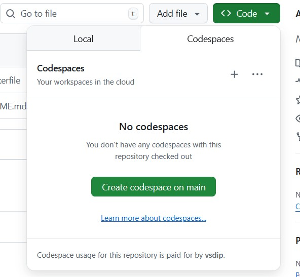
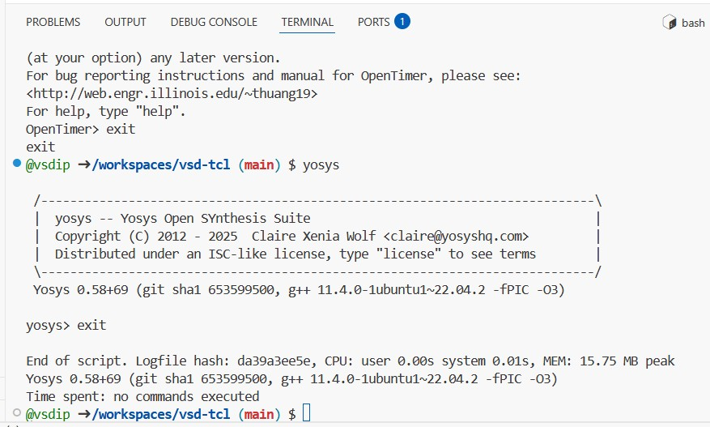
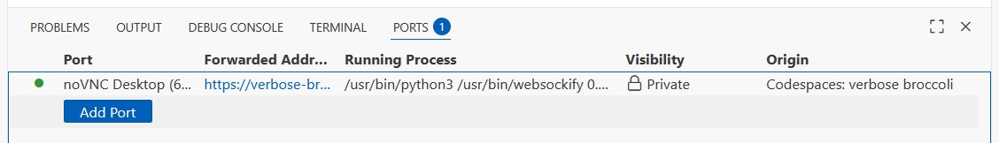
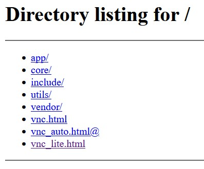

---

## VSD-TCL Environment (OpenTimer + Yosys)

This Codespace provides a ready-to-use synthesis and timing analysis setup on **Ubuntu 22.04**, with both **terminal** and **GUI (noVNC)** access.

---

### Step 1 – Open the Codespace

1. Go to the GitHub repository:
   **[https://github.com/vsdip/vsd-tcl](https://github.com/vsdip/vsd-tcl)**
2. Click **“Code” → “Open with Codespaces”** to launch the environment in your browser.



---

### Option 1 – Use the Terminal

Once the Codespace opens, go to the **TERMINAL** tab and run:

```bash
OpenTimer
```

or

```bash
yosys
```

Exit anytime using `exit`.



---

### Option 2 – Use the GUI (noVNC Desktop)

1. In your Codespace, open the **PORTS** tab.
2. Find the forwarded port named **noVNC Desktop (6080)**.
3. Click the forwarded URL.
4. On the web page, select **`vnc_lite.html`** to open the XFCE desktop.
5. Inside the desktop terminal, run:

   ```bash
   OpenTimer
   yosys
   ```




---

### Installed Tools

| Tool      | Command     | Description            |
| --------- | ----------- | ---------------------- |
| OpenTimer | `OpenTimer` | Static Timing Analyzer |
| Yosys     | `yosys`     | RTL Synthesis Tool     |

---

### Verify Installation

```bash
OpenTimer -h
yosys -V
```

Both commands should display version information.

---

Would you like me to add a short “Tips / Troubleshooting” section at the end (for slow Codespace load or VNC reconnect)?
